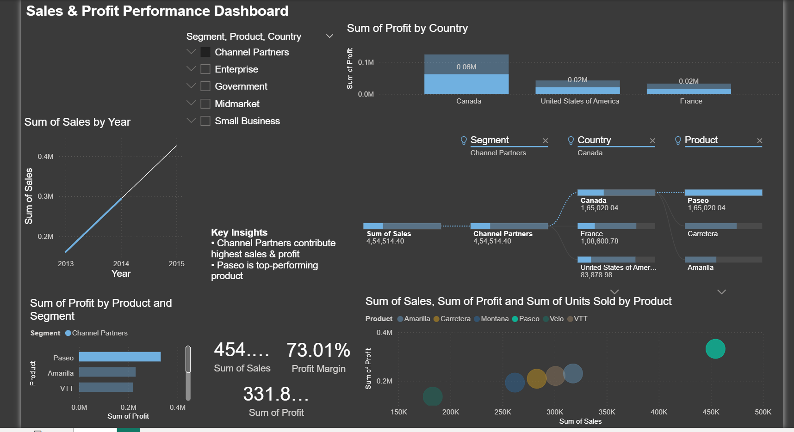

# Sales & Profit Performance Dashboard

## 📊 Project Overview
This project is a Power BI dashboard designed to analyze sales, profit, and performance across products, segments, and countries.

## 🚀 Features
- KPI metrics: Total Sales, Total Profit, Profit Margin
- Sales trend analysis over time
- Top-performing products and countries
- Profit vs Sales analysis using scatter plot
- Interactive filters for segment, product, and country

## 🛠️ Tools Used
- Power BI
- Data Visualization
- Basic DAX

##   Dashboard

## 📌 Insights
- Channel Partners contribute the highest sales and profit
- Paseo is the top-performing product
- Some products have high sales but lower profit margins
